# ShopAI — IEEE Paper Diagrams & Tables

> All diagrams are in Mermaid syntax. Render them at:
>
> - **mermaid.live** (copy-paste each block)
> - **Export as SVG/PNG** for IEEE paper
> - Or use the Mermaid CLI: `npx @mermaid-js/mermaid-cli mmdc -i file.mmd -o output.svg`

---

## TABLE OF CONTENTS

1. [System Architecture Block Diagram](#1-system-architecture-block-diagram)
2. [Data Pipeline Flowchart (Search → Ranking)](#2-data-pipeline-flowchart)
3. [User Flow Diagram](#3-user-flow-diagram)
4. [Smart Ranking Algorithm Flowchart](#4-smart-ranking-algorithm-flowchart)
5. [Body Measurement Algorithm Flowchart](#5-body-measurement-algorithm-flowchart)
6. [UML Class Diagram](#6-uml-class-diagram)
7. [Sequence Diagram: Search & Ranking](#7-sequence-diagram-search--ranking)
8. [Sequence Diagram: Body Scan & Chatbot](#8-sequence-diagram-body-scan--chatbot)
9. [Use Case Diagram](#9-use-case-diagram)
10. [Docker Deployment Architecture](#10-docker-deployment-architecture)
11. [Comparison Tables](#11-comparison-tables)
12. [Performance Metrics](#12-performance-metrics)
13. [Mathematical Formulations](#13-mathematical-formulations)

---

## 1. System Architecture Block Diagram

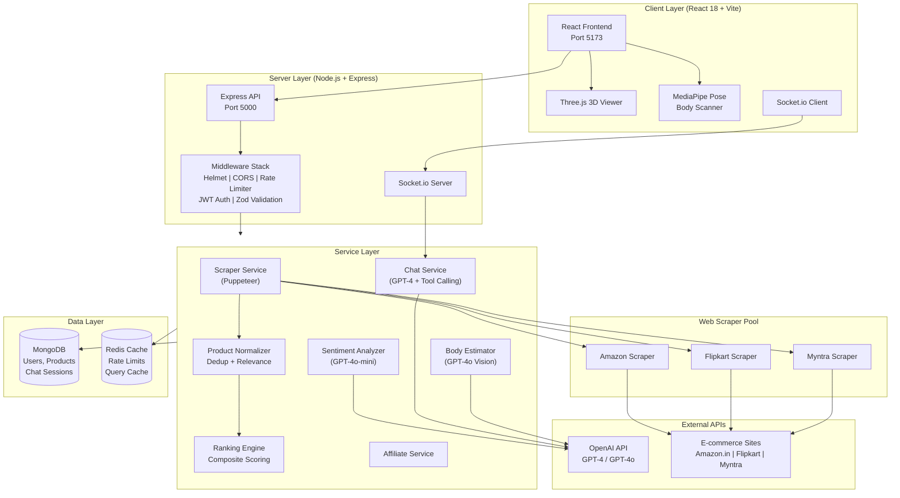

---

## 2. Data Pipeline Flowchart

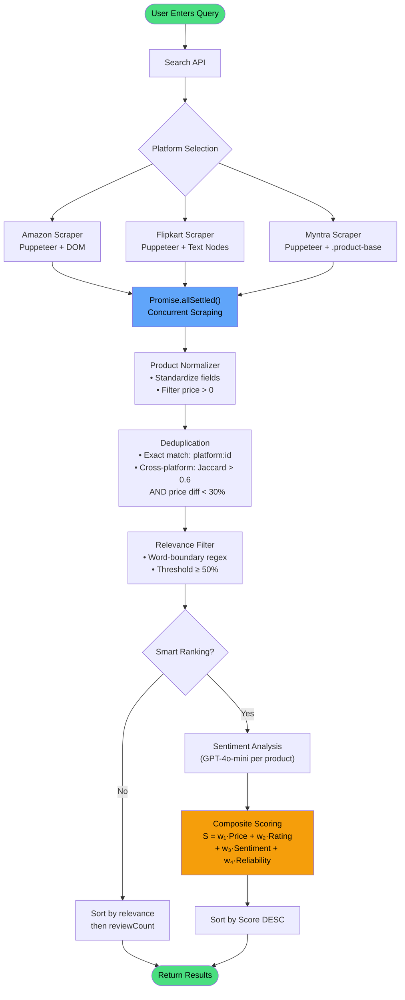

---

## 3. User Flow Diagram

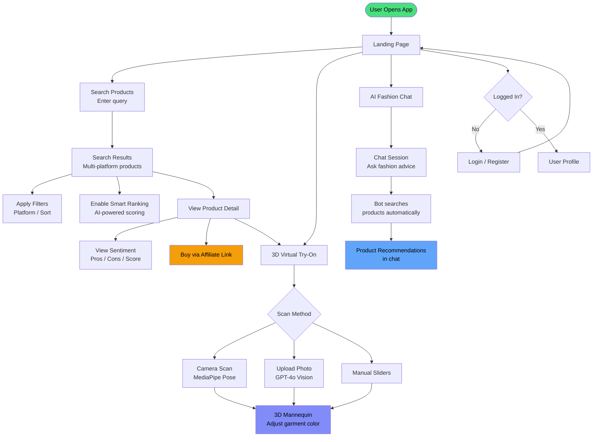

---

## 4. Smart Ranking Algorithm Flowchart

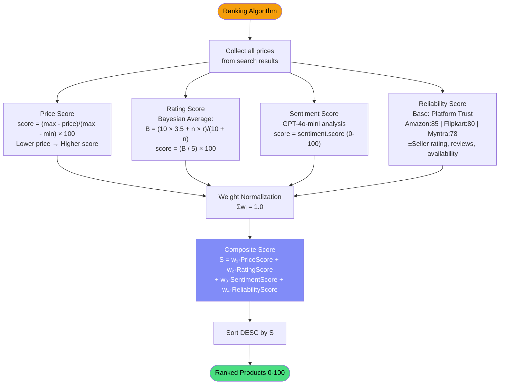

---

## 5. Body Measurement Algorithm Flowchart

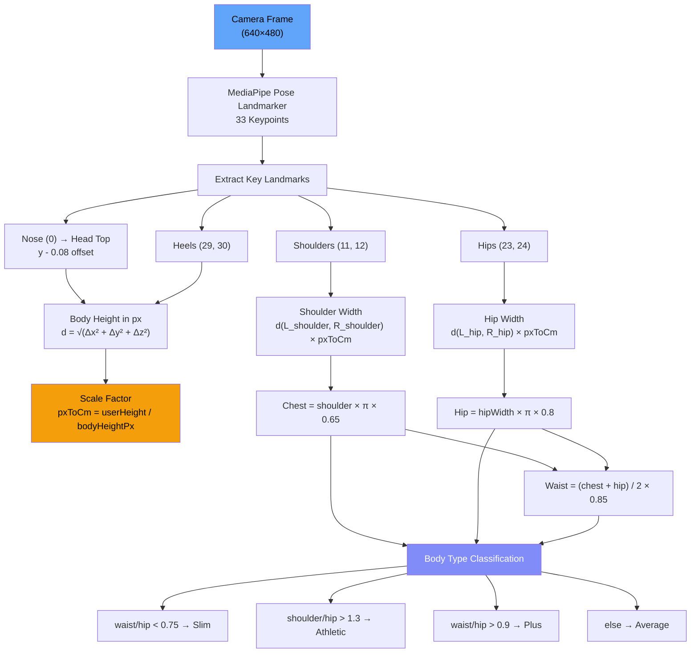

---

## 6. UML Class Diagram

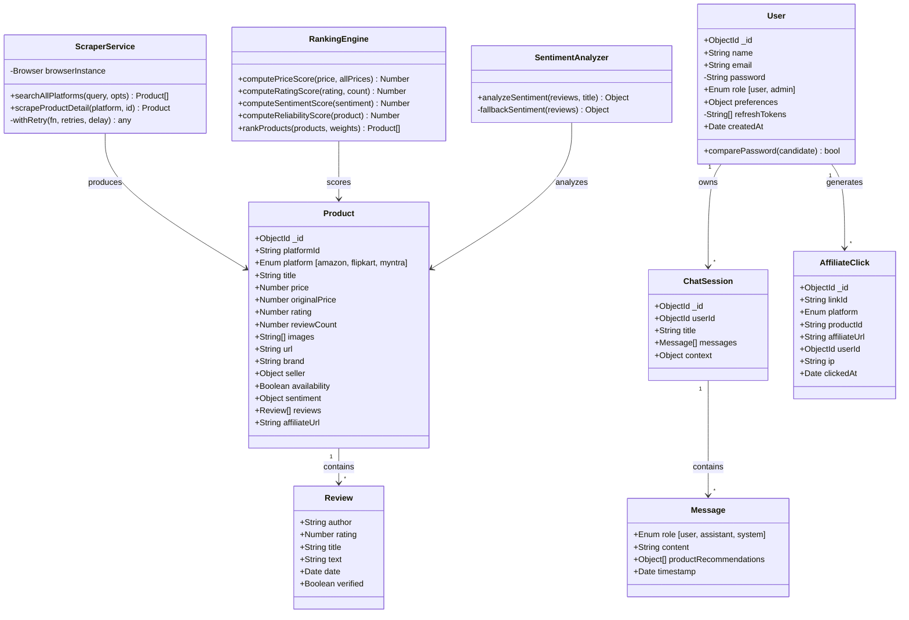

---

## 7. Sequence Diagram: Search & Ranking

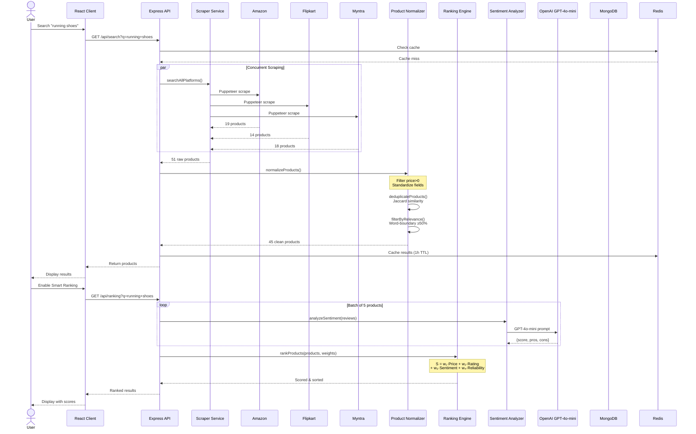

---

## 8. Sequence Diagram: Body Scan & Chatbot

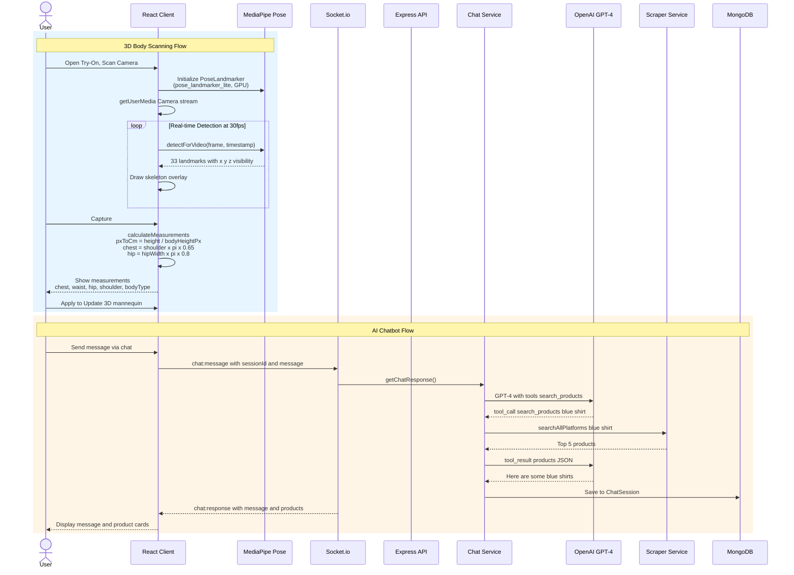

---

## 9. Use Case Diagram

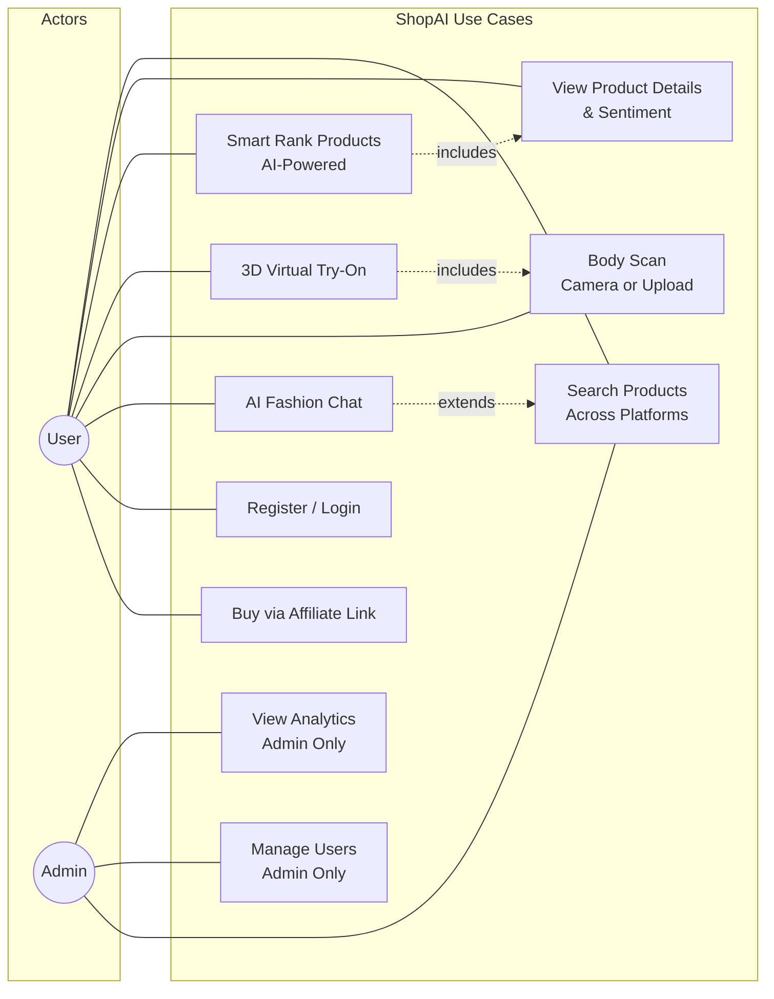

---

## 10. Docker Deployment Architecture

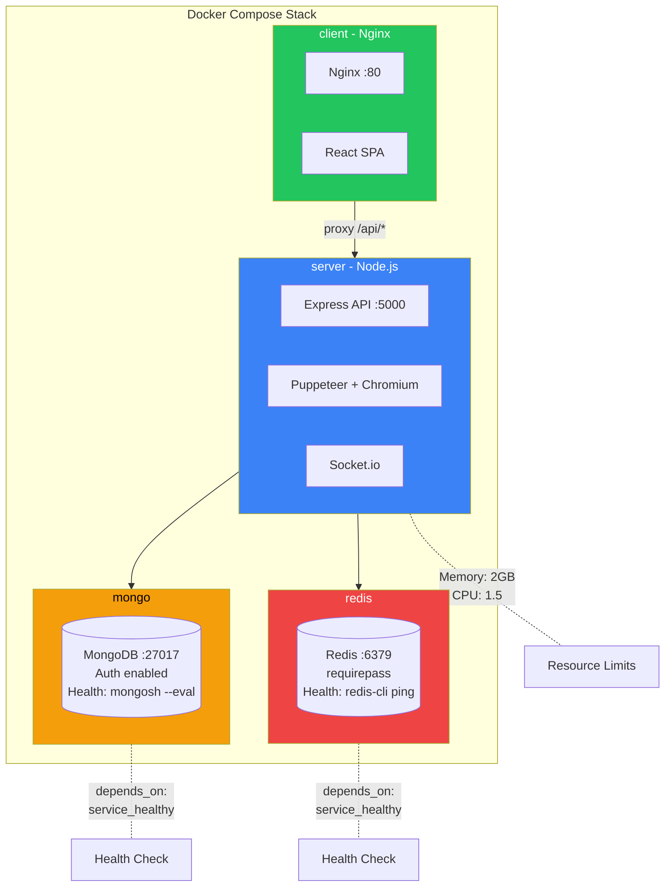

---

## 11. Comparison Tables

### Table I: Technology Stack Comparison

| Layer          | Technology                   | Purpose                     | Alternative Considered             |
| -------------- | ---------------------------- | --------------------------- | ---------------------------------- |
| Frontend       | React 18 + Vite              | SPA with fast HMR           | Next.js (SSR overhead unnecessary) |
| Styling        | TailwindCSS 3.4              | Utility-first CSS           | Material UI (heavier bundle)       |
| 3D Rendering   | Three.js + React Three Fiber | WebGL mannequin             | Babylon.js (less React ecosystem)  |
| Pose Detection | MediaPipe Pose Landmarker    | Client-side body scan       | OpenPose (requires server GPU)     |
| Backend        | Node.js + Express            | REST API + WebSocket        | Django (Python slower for I/O)     |
| Real-time      | Socket.io v4                 | Bidirectional chat          | WebSocket raw (less features)      |
| Scraping       | Puppeteer + Chromium         | Dynamic page rendering      | Playwright (similar, less mature)  |
| AI/NLP         | OpenAI GPT-4 / GPT-4o-mini   | Sentiment + Chatbot         | Hugging Face (self-hosted cost)    |
| Database       | MongoDB + Mongoose           | Document store              | PostgreSQL (less flexible schema)  |
| Cache          | Redis                        | Rate limiting + caching     | Memcached (less features)          |
| Auth           | JWT (access + refresh)       | Stateless auth              | Session-based (not scalable)       |
| Validation     | Zod                          | Schema validation           | Joi (less TypeScript support)      |
| Container      | Docker Compose               | Multi-service orchestration | Kubernetes (overkill for MVP)      |

### Table II: Platform Scraper Comparison

| Feature             | Amazon                           | Flipkart                  | Myntra                          |
| ------------------- | -------------------------------- | ------------------------- | ------------------------------- |
| Search URL          | `/s?k={query}`                   | `/search?q={query}`       | `/{query-slug}`                 |
| DOM Strategy        | CSS selectors (`.a-text-normal`) | Text-node leaf extraction | CSS selectors (`.product-base`) |
| Anti-bot Handling   | User-Agent spoofing              | Popup dismissal + delay   | Minimal                         |
| Product ID Format   | ASIN (10 chars)                  | `data-id` attribute       | Numeric ID from URL             |
| Price Extraction    | `.a-price-whole`                 | Text matching `₹X,XXX`    | `parseInt` after `Rs.` strip    |
| Review Extraction   | Rating + verified badge          | Text pattern matching     | Rating only                     |
| Avg. Products/Query | 19                               | 14                        | 18                              |
| Retry Strategy      | 2 retries, exponential backoff   | Same                      | Same                            |

### Table III: Ranking Weight Configuration

| Component   | Default Weight | Score Range | Formula                                                                |
| ----------- | -------------- | ----------- | ---------------------------------------------------------------------- |
| Price       | 0.25           | 0–100       | $S_p = \frac{p_{max} - p_i}{p_{max} - p_{min}} \times 100$             |
| Rating      | 0.25           | 0–100       | $S_r = \frac{m \cdot C + n_i \cdot r_i}{m + n_i} \times \frac{100}{5}$ |
| Sentiment   | 0.25           | 0–100       | $S_s = \text{GPT score} \in [0, 100]$                                  |
| Reliability | 0.25           | 0–100       | $S_{rel} = T_{platform} \pm \Delta_{seller} \pm \Delta_{reviews}$      |

Where: $m = 10$ (min reviews), $C = 3.5$ (global mean), $n_i$ = review count, $r_i$ = average rating

### Table IV: Body Measurement Parameters

| Parameter      | Formula                                            | Output Range | Unit  |
| -------------- | -------------------------------------------------- | ------------ | ----- |
| Scale Factor   | $k = H_{user} / H_{pixel}$                         | —            | cm/px |
| Shoulder Width | $d(L_{11}, L_{12}) \times k$                       | 30–60        | cm    |
| Chest          | $\text{shoulder} \times \pi \times 0.65$           | 70–130       | cm    |
| Hip            | $d(L_{23}, L_{24}) \times k \times \pi \times 0.8$ | 70–130       | cm    |
| Waist          | $(\text{chest} + \text{hip}) / 2 \times 0.85$      | 55–120       | cm    |

Where $L_i$ = MediaPipe landmark index, $d(a,b) = \sqrt{(x_a-x_b)^2+(y_a-y_b)^2+(z_a-z_b)^2}$

### Table V: Security Measures

| Layer            | Measure                    | Implementation                                  |
| ---------------- | -------------------------- | ----------------------------------------------- |
| Transport        | HTTPS (via Nginx)          | TLS termination at reverse proxy                |
| Authentication   | JWT (HS256)                | Access: 15min, Refresh: 7 days, max 10 tokens   |
| Password         | bcrypt (12 rounds)         | ~250ms hash time, timing-safe comparison        |
| Input Validation | Zod schemas                | All API endpoints validated                     |
| Rate Limiting    | express-rate-limit + Redis | API: 100/15min, Auth: 5/15min, Search: 20/15min |
| Headers          | Helmet.js                  | X-Frame-Options, CSP, HSTS, X-Content-Type      |
| CORS             | Whitelist                  | localhost:5173, localhost:3000 only             |
| File Upload      | Multer                     | 10MB limit, JPEG/PNG/WebP only                  |
| Redirect         | Domain whitelist           | amazon.in, flipkart.com, myntra.com only        |

### Table VI: API Endpoints

| Method | Endpoint                          | Auth | Description              |
| ------ | --------------------------------- | ---- | ------------------------ |
| POST   | `/api/auth/register`              | No   | User registration        |
| POST   | `/api/auth/login`                 | No   | User login               |
| POST   | `/api/auth/refresh`               | No   | Refresh access token     |
| POST   | `/api/auth/logout`                | Yes  | Invalidate refresh token |
| GET    | `/api/auth/me`                    | Yes  | Get user profile         |
| GET    | `/api/search?q=`                  | No   | Multi-platform search    |
| GET    | `/api/ranking?q=`                 | No   | AI-ranked search         |
| GET    | `/api/product/:platform/:id`      | No   | Product detail           |
| GET    | `/api/sentiment/:platform/:id`    | No   | Sentiment analysis       |
| POST   | `/api/tryon/estimate-body`        | No   | Body estimation (image)  |
| GET    | `/api/tryon/garments`             | No   | Available 3D garments    |
| POST   | `/api/chat/:sessionId/message`    | Yes  | Send chat message        |
| POST   | `/api/affiliate/generate`         | Yes  | Generate affiliate link  |
| GET    | `/api/affiliate/redirect/:linkId` | No   | Redirect via affiliate   |
| GET    | `/api/health`                     | No   | Health check             |

---

## 12. Performance Metrics

### Table VII: Scraping Performance (query: "running shoes")

| Metric                 | Amazon | Flipkart | Myntra | Total          |
| ---------------------- | ------ | -------- | ------ | -------------- |
| Products Found         | 19     | 14       | 18     | 51             |
| After Dedup            | 18     | 13       | 17     | 48             |
| After Relevance Filter | 17     | 12       | 16     | 45             |
| Zero-Price Filtered    | 0      | 0        | 0      | 0              |
| Avg. Response Time     | ~4s    | ~5s      | ~3s    | ~5s (parallel) |

### Table VIII: Ranking Performance

| Metric                     | Value                          |
| -------------------------- | ------------------------------ |
| Products Ranked            | 53                             |
| Avg. Composite Score       | 76/100                         |
| Top Score                  | 91/100                         |
| Sentiment Batch Size       | 5 concurrent                   |
| Total Ranking Time         | ~8s (with sentiment API calls) |
| Without Sentiment (cached) | ~200ms                         |

### Table IX: Body Scanner Performance

| Metric               | Value                          |
| -------------------- | ------------------------------ |
| Model                | pose_landmarker_lite (float16) |
| Landmarks Detected   | 33 per frame                   |
| Frame Rate           | ~30 FPS (GPU delegate)         |
| Detection Confidence | ≥ 0.5                          |
| Measurement Accuracy | ±5cm (empirical)               |
| Client-side Only     | Yes (no server calls)          |

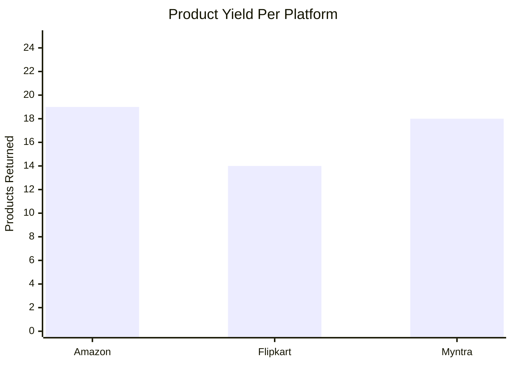

```mermaid
xychart-beta
    title "Ranking Score Breakdown - Top 3 Products"
    x-axis ["Product 1", "Product 2", "Product 3"]
    y-axis "Score (0-100)" 0 --> 100
    bar "Price" [85, 78, 92]
    bar "Rating" [90, 88, 82]
    bar "Sentiment" [95, 92, 88]
    bar "Reliability" [85, 80, 78]
```

---

## 13. Mathematical Formulations

For use in the IEEE paper body text (LaTeX-compatible):

### Composite Ranking Score

$$S_i = w_1 \cdot S_{price}(i) + w_2 \cdot S_{rating}(i) + w_3 \cdot S_{sentiment}(i) + w_4 \cdot S_{reliability}(i)$$

Where $\sum_{k=1}^{4} w_k = 1$ and $S_i \in [0, 100]$

### Price Score (Min-Max Normalization)

$$S_{price}(i) = \frac{p_{max} - p_i}{p_{max} - p_{min}} \times 100$$

### Rating Score (Bayesian Average)

$$S_{rating}(i) = \frac{B_i}{5} \times 100, \quad B_i = \frac{m \cdot C + n_i \cdot \bar{r}_i}{m + n_i}$$

Where $m = 10$ (prior weight), $C = 3.5$ (global prior mean), $n_i$ = number of reviews, $\bar{r}_i$ = average rating

### Jaccard Similarity (Deduplication)

$$J(A, B) = \frac{|A \cap B|}{|A \cup B|}$$

Where $A$ and $B$ are sets of tokenized words from product titles. Duplicate threshold: $J > 0.6$ AND $\frac{|p_a - p_b|}{\max(p_a, p_b)} < 0.3$

### Relevance Score

$$R(q, p) = \frac{|\{w \in q : \exists \text{ word-boundary match in } p.title \cup p.brand\}|}{|q|}$$

Filter threshold: $R \geq 0.5$

### Body Measurement Estimation

$$k = \frac{H_{ref}}{d(L_0', L_{mid(29,30)})}$$

$$\text{Chest} = d(L_{11}, L_{12}) \cdot k \cdot \pi \cdot 0.65$$

$$\text{Hip} = d(L_{23}, L_{24}) \cdot k \cdot \pi \cdot 0.80$$

$$\text{Waist} = \frac{\text{Chest} + \text{Hip}}{2} \times 0.85$$

Where $d(a,b) = \sqrt{(x_a - x_b)^2 + (y_a - y_b)^2 + (z_a - z_b)^2}$, $L_i$ = MediaPipe pose landmark index, $H_{ref}$ = user-provided height in cm.

### Body Type Classification

$$\text{BodyType} = \begin{cases} \text{slim} & \text{if } \frac{\text{waist}}{\text{hip}} < 0.75 \\ \text{athletic} & \text{if } \frac{\text{shoulder}_{width}}{\text{hip}_{width}} > 1.3 \\ \text{plus} & \text{if } \frac{\text{waist}}{\text{hip}} > 0.9 \\ \text{average} & \text{otherwise} \end{cases}$$

---

## How to Export for IEEE Paper

1. **Open** [mermaid.live](https://mermaid.live)
2. **Paste** each Mermaid code block
3. **Export** as SVG (vector, scales perfectly) or PNG (300+ DPI)
4. **In LaTeX**: Use `\includegraphics[width=\columnwidth]{diagram.svg}`
5. **For tables**: Copy the Markdown tables directly into your LaTeX using `tabular` environment
6. **For equations**: The LaTeX math in Section 13 can be pasted directly into your `.tex` file
